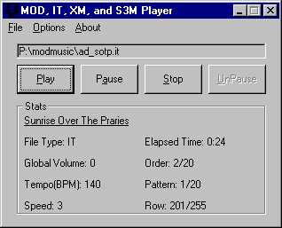



## MOD, IT, XM, and S3M Player Using FMOD\.DLL

### Description

Requires FMOD.DLL. Download at http://www.fmod.org before using.

This is a simple informative player that plays MOD, IT, XM, and S3M files. If you don't know them, it is a good thing to know for game programmers. These types of files are MP3 quality files with no compression, but a little bit more size compared to a MIDI file. It is basicallly a set of samples and commands of when to play them, and transposition so they can make notes. I never seen one made in VB, so I made it just to see if it is possible. I spent only 10min on version one, and 5hours on bug fixes. Overall, it is just some API with FMOD.DLL. The system needs to be shutdown before using. I used the API for the Opening Dialog as they say the less custom controls, the better (this one uses none). I wrote this all by myself. This does not display the length of the song. It is because you need to fastfoward play this as fast as possible and sending the sound to nowhere to find out the length. The format is very complicated, more complicated than wav and midi multiplied as they made the format weird. Like Rows 1,3 at the beginning, 2,4 at the end, 5,7 before 1,3, and 4,6 after 2,4. That makes it almost impossble to load.
 
### More Info
 
Autodetection doesn't work if file extension is wrong.

             |
---                |---
**Submitted On**   |2002-08-05 21:17:28
**By**             |[excelblue \(Mark Lu\)](https://github.com/Planet-Source-Code/PSCIndex/blob/master/ByAuthor/excelblue-mark-lu.md)
**Level**          |Intermediate
**User Rating**    |4.7 (14 globes from 3 users)
**Compatibility**  |VB 5\.0, VB 6\.0
**Category**       |[Sound/MP3](https://github.com/Planet-Source-Code/PSCIndex/blob/master/ByCategory/sound-mp3__1-45.md)
**World**          |[Visual Basic](https://github.com/Planet-Source-Code/PSCIndex/blob/master/ByWorld/visual-basic.md)
**Archive File**   |[MOD,\_IT,\_X114773852002\.zip](https://github.com/Planet-Source-Code/excelblue-mark-lu-mod-it-xm-and-s3m-player-using-fmod-dll__1-37660/archive/master.zip)

